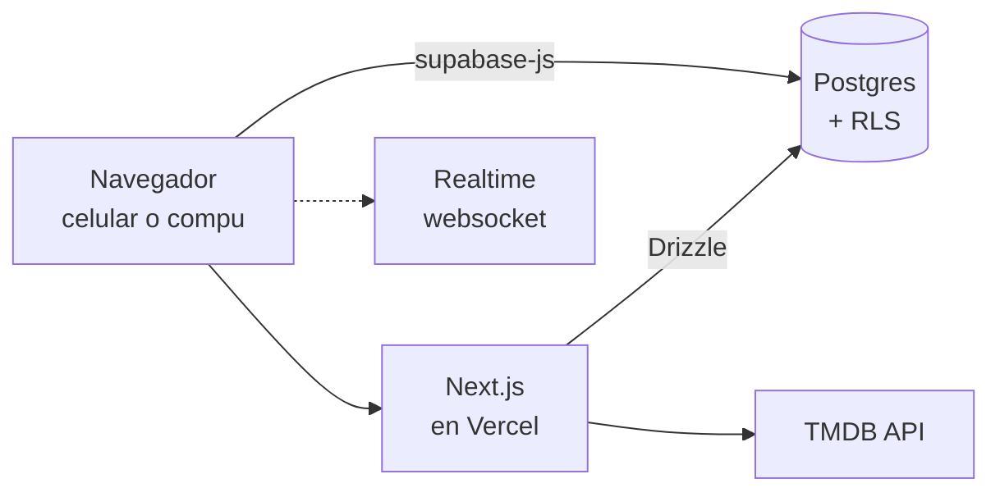

# Libreta de pelis — plan técnico

## Qué construimos

Una app privada para vos y Ceci donde cada uno puntúa y comenta las películas que vieron juntos, con la ficha completada automáticamente desde TMDB. Una sola app web en Next.js, que se usa desde el celular de los dos y también desde la compu.

La v1 tiene cinco pantallas, las del canvas de diseño:

| Pantalla | Qué hace |
| --- | --- |
| Biblioteca | Lista de vistas, con el puntaje de cada uno y el promedio |
| Ficha | Detalle: puntaje y comentario individual, fecha, lugar, sinopsis |
| Agregar | Busca en TMDB y da de alta como vista o pendiente |
| Pendientes | Watchlist compartida, con quién la sumó |
| Resumen | Totales, conteo por género, distribución de puntajes, filtros |

Tres reglas que definen el producto y hay que respetar en el modelo de datos:

1. Cada persona tiene su propio puntaje y su propio comentario. El promedio es derivado, nunca se guarda.
2. Una película puede estar en la biblioteca sin que los dos la hayan puntuado todavía.
3. Los datos de la película (póster, año, director, género, sinopsis) vienen de TMDB y se guardan una sola vez, no por cada pareja ni por cada usuario.

## Arquitectura

Una app Next.js (App Router) en Vercel y Supabase como base de datos. El navegador habla con Postgres directo para lo interactivo, y con el servidor de Next para la carga inicial y para TMDB.



El reparto entre servidor y navegador:

- **Server Components** hacen la primera lectura de cada pantalla, con Drizzle. La biblioteca llega renderizada con datos, sin spinner ni salto de layout.
- **Client Components** manejan lo que reacciona: puntuar, filtrar, buscar. Usan `supabase-js` desde el navegador, con la sesión en cookies.
- **La RLS sigue siendo la que protege todo.** Que el navegador le pegue directo a Postgres es seguro justamente por eso: las políticas viven en la base, no en el código.
- **Route Handler** para TMDB, porque la clave no puede salir al navegador.
- **Realtime** por websocket desde el cliente: cuando Ceci puntúa desde su celular, tu pantalla se actualiza sola.

Lo que desaparece respecto del plan nativo: la Edge Function en Deno (ahora es una ruta más de Next), los deep links del magic link, y la segunda app entera.

## Modelo de datos

Cinco tablas. La clave del diseño está en separar `entradas` (la película en la libreta de la pareja) de `puntajes` (lo que opina cada uno), que es lo que permite que cada uno tenga su estrella y su comentario.

```sql
-- Una pareja = un espacio. Con dos filas de miembros alcanza.
create table espacios (
  id uuid primary key default gen_random_uuid(),
  nombre text not null,
  creado_en timestamptz not null default now()
);

create table perfiles (
  id uuid primary key references auth.users(id) on delete cascade,
  espacio_id uuid not null references espacios(id) on delete cascade,
  nombre text not null,
  color text not null default 'terracota',
  tema text not null default 'papel'
);

-- Ficha de TMDB, global: una fila por película, no por pareja.
create table peliculas (
  tmdb_id integer primary key,
  titulo text not null,
  titulo_original text,
  anio smallint,
  duracion_min smallint,
  director text,
  generos text[] not null default '{}',
  poster_path text,
  sinopsis text,
  actualizada_en timestamptz not null default now()
);

-- La película dentro de la libreta de una pareja.
create table entradas (
  id uuid primary key default gen_random_uuid(),
  espacio_id uuid not null references espacios(id) on delete cascade,
  tmdb_id integer not null references peliculas(tmdb_id),
  estado text not null check (estado in ('vista','pendiente')),
  vista_el date,
  lugar text,
  agregada_por uuid not null references perfiles(id),
  creada_en timestamptz not null default now(),
  unique (espacio_id, tmdb_id)
);

-- Una fila por persona y por entrada.
create table puntajes (
  entrada_id uuid not null references entradas(id) on delete cascade,
  perfil_id uuid not null references perfiles(id) on delete cascade,
  estrellas numeric(2,1) not null check (estrellas between 0.5 and 5),
  comentario text,
  actualizado_en timestamptz not null default now(),
  primary key (entrada_id, perfil_id)
);

create index on entradas (espacio_id, estado, creada_en desc);
```

Detalles que importan más de lo que parecen:

- `estrellas` es `numeric(2,1)`, no entero, porque el diseño muestra medias estrellas (4,5).
- `unique (espacio_id, tmdb_id)` evita que la misma peli entre dos veces. En la pantalla de búsqueda es lo que enciende el cartel «Ya está en la biblioteca».
- `poster_path` guarda el fragmento que devuelve TMDB (`/abc123.jpg`), no la URL entera. La base de la URL cambia cada tanto y no querés migrar filas por eso.
- El paso de pendiente a vista es un `update` del campo `estado`, no una fila nueva. Así no se pierde quién la había sumado.

Ese SQL es lo que termina en la base, pero no lo vas a escribir a mano: sale del esquema de Drizzle, dos secciones más abajo.

## Seguridad: RLS

Todo se apoya en una sola pregunta: ¿el usuario pertenece al espacio de esta fila? Se resuelve con una función y después se reutiliza en todas las políticas.

```sql
create or replace function mi_espacio()
returns uuid
language sql stable security definer
as $$ select espacio_id from perfiles where id = auth.uid() $$;

alter table entradas enable row level security;
alter table puntajes enable row level security;
alter table perfiles enable row level security;
alter table peliculas enable row level security;

-- La libreta: se lee y se escribe solo dentro del propio espacio.
create policy entradas_rw on entradas
  for all using (espacio_id = mi_espacio())
  with check (espacio_id = mi_espacio());

-- Los puntajes del espacio se leen; solo se escribe el propio.
create policy puntajes_lectura on puntajes
  for select using (
    exists (select 1 from entradas e
            where e.id = entrada_id and e.espacio_id = mi_espacio()));

create policy puntajes_escritura on puntajes
  for all using (perfil_id = auth.uid())
  with check (perfil_id = auth.uid());

-- Las fichas de TMDB las lee cualquiera autenticado; escribe solo el servidor.
create policy peliculas_lectura on peliculas
  for select to authenticated using (true);
```

La política de `puntajes` es la que hace cumplir la regla del producto: los dos ven las estrellas del otro, pero nadie puede editar las ajenas. Eso queda garantizado en la base, sin importar qué haga el cliente.

`mi_espacio()` es `security definer` a propósito: necesita leer `perfiles` sin quedar atrapada en la RLS de esa misma tabla. Es el patrón estándar de Supabase para esto.

Probá las políticas antes de escribir una línea de React. Abrí dos sesiones con `set request.jwt.claims` distintos en el SQL editor e intentá leer y escribir cruzado. Un error de RLS descubierto desde la app se diagnostica muchísimo peor.

## Drizzle

El esquema se escribe una vez en TypeScript y de ahí salen las migraciones y los tipos de todas las queries.

```ts
// db/schema.ts
export const entradas = pgTable('entradas', {
  id:          uuid('id').primaryKey().defaultRandom(),
  espacioId:   uuid('espacio_id').notNull()
                 .references(() => espacios.id, { onDelete: 'cascade' }),
  tmdbId:      integer('tmdb_id').notNull()
                 .references(() => peliculas.tmdbId),
  estado:      text('estado', { enum: ['vista', 'pendiente'] }).notNull(),
  vistaEl:     date('vista_el'),
  lugar:       text('lugar'),
  agregadaPor: uuid('agregada_por').notNull().references(() => perfiles.id),
  creadaEn:    timestamp('creada_en', { withTimezone: true })
                 .notNull().defaultNow(),
}, (t) => [
  unique().on(t.espacioId, t.tmdbId),
  index().on(t.espacioId, t.estado),
]);

export const puntajes = pgTable('puntajes', {
  entradaId:  uuid('entrada_id').notNull()
                .references(() => entradas.id, { onDelete: 'cascade' }),
  perfilId:   uuid('perfil_id').notNull()
                .references(() => perfiles.id, { onDelete: 'cascade' }),
  estrellas:  numeric('estrellas', { precision: 2, scale: 1 }).notNull(),
  comentario: text('comentario'),
}, (t) => [primaryKey({ columns: [t.entradaId, t.perfilId] })]);
```

Lo que ganás: los tipos de cada query salen del esquema, sin escribir interfaces a mano, y los joins de verdad — traer una entrada con sus dos puntajes y la ficha de TMDB en una sola consulta — quedan tipados y legibles. Era justo la parte más incómoda de PostgREST.

Ahora la trampa, que es grande:

> Drizzle se conecta por el protocolo de Postgres, no por PostgREST. Con la connection string de siempre entra como dueño de la base y **la RLS no se aplica**. Toda la sección anterior deja de protegerte.

Hay dos salidas, y conviene elegir a conciencia:

**A. Drizzle respetando la RLS.** Cada query corre dentro de una transacción que fija el rol `authenticated` y los claims del JWT del usuario (`set local role` y `set local request.jwt.claims`), que es exactamente lo que leen tus políticas. Drizzle trae helpers para esto en `drizzle-orm/supabase`, e incluso permite declarar las políticas dentro del mismo esquema. Más setup, pero la seguridad sigue viviendo en la base.

**B. Conexión privilegiada y el filtro en el código.** Todas las lecturas pasan por funciones del servidor que filtran por el espacio del usuario, y la RLS queda solo como red para lo que el navegador lee directo. Menos piezas, pero la regla real pasa a estar en tu código: si una query se olvida del `where`, no hay nada abajo que te salve.

Para dos usuarios cualquiera de las dos funciona. Yo iría por **A**, porque las políticas ya están escritas y sería raro dejarlas de adorno. Verificá la API contra la documentación de Drizzle antes de escribirla: es la parte que más se movió en los últimos releases.

**El pooler, sí o sí.** En Vercel cada request puede caer en una instancia nueva, así que usá la connection string del pooler de Supabase en modo transacción (puerto 6543), no la directa del 5432. Y en modo transacción hay que apagar los prepared statements:

```ts
// db/index.ts
const client = postgres(process.env.DATABASE_URL!, { prepare: false });
export const db = drizzle(client, { schema });
```

Sin ese `prepare: false` anda perfecto en desarrollo y falla en producción con errores de prepared statement, que es la peor clase de bug.

**Lo que Drizzle no hace:** el auth y el Realtime siguen siendo de `supabase-js` en el navegador. El reparto final es Drizzle para todo lo que lee el servidor, `supabase-js` para la sesión y los websockets.

Una advertencia de prolijidad: con Drizzle manejando las migraciones, no toques el esquema desde la UI de Supabase. Dos fuentes de verdad para la misma base es el tipo de problema que aparece tres meses después y cuesta horas.

## TMDB: el route handler

Un solo archivo, `app/api/peliculas/route.ts`, con dos métodos. La clave de TMDB vive en `process.env.TMDB_API_KEY` — sin el prefijo `NEXT_PUBLIC_`, que es lo que la mandaría al bundle del navegador.

| Método | Request | Devuelve |
| --- | --- | --- |
| `GET` | `/api/peliculas?q=interstellar` | Coincidencias ya normalizadas |
| `POST` | `{ tmdb_id }` | Inserta la ficha completa en `peliculas` y la devuelve |

El contrato que consume el front:

```json
{
  "resultados": [
    {
      "tmdb_id": 157336,
      "titulo": "Interstellar",
      "anio": 2014,
      "director": "Christopher Nolan",
      "duracion_min": 169,
      "generos": ["Ciencia ficción", "Drama"],
      "poster_path": "/abc123.jpg",
      "sinopsis": "...",
      "ya_en_biblioteca": false
    }
  ]
}
```

Cuatro decisiones de implementación:

1. **Un solo parámetro de idioma.** Llamá a TMDB con `language=es-AR`. Si la peli no tiene sinopsis traducida, TMDB devuelve el campo vacío en lugar del inglés: en ese caso pedí de nuevo con `en-US` y guardá lo que venga. Es el único caso borde molesto de la API.
2. **El director no viene en `/search`.** Viene en `/movie/{id}?append_to_response=credits`. Por eso importar es un segundo llamado: la búsqueda muestra título, año y póster, y el resto se completa cuando eligen la peli.
3. **`ya_en_biblioteca` lo calcula el handler**, cruzando contra `entradas` con la sesión del usuario. Es lo que apaga el botón en la pantalla de búsqueda.
4. **El caché sale gratis.** El `fetch` de Next cachea del lado del servidor con `next: { revalidate: 86400 }` en el llamado a TMDB, y la tabla `peliculas` hace de caché permanente de las fichas ya importadas. Acá murió la conversación sobre Redis.

Los pósters se piden a `https://image.tmdb.org/t/p/w342` + `poster_path` en la grilla y `w500` en la ficha. Si usás `next/image`, agregá `image.tmdb.org` a `remotePatterns` en `next.config.ts` o te va a tirar error en el primer render.

## Estadísticas y filtros

El resumen se calcula en Postgres, no en el navegador. Son agregaciones que la base resuelve mucho mejor, y el Server Component recibe el resultado ya listo para pintar.

```sql
-- Una fila por entrada, con el promedio de la pareja ya resuelto.
create view v_entradas_puntuadas as
select e.*, p.titulo, p.anio, p.generos, p.poster_path,
       avg(pt.estrellas) as promedio,
       count(pt.perfil_id) as cuantos_puntuaron
from entradas e
join peliculas p on p.tmdb_id = e.tmdb_id
left join puntajes pt on pt.entrada_id = e.id
group by e.id, p.tmdb_id;

-- Conteo por género: un género por fila.
create view v_por_genero as
select e.espacio_id, g as genero, count(*) as cantidad
from entradas e
join peliculas p on p.tmdb_id = e.tmdb_id,
     unnest(p.generos) as g
where e.estado = 'vista'
group by e.espacio_id, g
order by cantidad desc;
```

Las vistas heredan la RLS de las tablas de abajo, así que no hay que declarar políticas nuevas.

Para los números sueltos de la pantalla de resumen (total de vistas, promedio general, horas, en cuántas coincidieron) conviené una función RPC que devuelva un solo JSON. Es un round trip en vez de cuatro:

```sql
create or replace function resumen()
returns json language sql stable as $$
  select json_build_object(
    'vistas',      count(*),
    'promedio',    round(avg(promedio)::numeric, 1),
    'horas',       round(sum(duracion_min) / 60.0),
    'coincidimos', count(*) filter (where cuantos_puntuaron = 2)
  )
  from v_entradas_puntuadas v
  join peliculas p on p.tmdb_id = v.tmdb_id
  where v.espacio_id = mi_espacio() and v.estado = 'vista';
$$;
```

Los filtros de la biblioteca (por género, por año, por puntaje mínimo) son `WHERE` sobre `v_entradas_puntuadas` armados con el query builder de Drizzle. No hace falta endpoint propio.

Las vistas y la función `resumen()` se crean en SQL, dentro de una migración de Drizzle. Para consultarlas con tipos, declaralas también en el esquema con `pgView`.

## La app

Next.js con App Router, TypeScript y Tailwind. Una ruta por pantalla, y las queries concentradas en un solo archivo para no dispersarlas entre componentes.

```
libreta/
  app/
    layout.tsx              tema, fuentes, nav
    page.tsx                Biblioteca
    peli/[id]/page.tsx      Ficha
    agregar/page.tsx        Buscar y dar de alta
    pendientes/page.tsx
    resumen/page.tsx
    ajustes/page.tsx
    api/peliculas/route.ts  TMDB
    auth/callback/route.ts  vuelta del magic link
  components/
    Estrellas.tsx           rating de 0,5 en 0,5
    Poster.tsx
    TarjetaPeli.tsx
    Nav.tsx                 tabs en mobile, sidebar en desktop
  db/
    schema.ts               las cinco tablas, en Drizzle
    index.ts                el cliente, contra el pooler
    queries.ts              todo el acceso a datos
  lib/
    supabase/client.ts      navegador: auth y realtime
    supabase/server.ts      sesión en Server Components
    tmdb.ts
  styles/
    temas.css               los dos temas como variables CSS
  drizzle.config.ts
  middleware.ts             refresco de sesión
```

Dependencias, las mínimas:

| Paquete | Para qué |
| --- | --- |
| `next`, `react` | App Router y Server Components |
| `@supabase/supabase-js` + `@supabase/ssr` | Auth por cookies, queries, realtime |
| `tailwindcss` | Layout y responsive; los colores salen de variables CSS |
| `next/font` | Caveat, Lora y Quicksand, self-hosted, sin pedirle nada a Google en runtime |
| `drizzle-orm` + `drizzle-kit` | Esquema en TypeScript, migraciones y tipos de las queries |
| `postgres` | El driver que usa Drizzle para hablar con el pooler de Supabase |

Tres cosas que te van a morder si no las prevés:

- **Usá `@supabase/ssr`, no los `auth-helpers` viejos.** Hay muchísimo tutorial desactualizado dando vueltas. El paquete nuevo es el que maneja bien cookies en middleware, Server Components y route handlers a la vez.
- **Realtime es solo del lado del cliente.** Un componente con `'use client'`, la suscripción en un `useEffect` con su cleanup, y `router.refresh()` cuando llega un cambio para que los Server Components vuelvan a leer. Sin el cleanup te quedan canales colgados y eventos duplicados.
- **Decidí temprano qué es server y qué es client.** La regla que funciona: la página lee en el servidor y pasa los datos como props; el componente que tiene estado o escucha eventos es client. Mezclarlo al azar es de donde salen los errores raros de hidratación.

## Mobile y desktop

El diseño del canvas es mobile-first y así se queda: en el celular se ve exactamente como lo diseñamos. El desktop no es esa misma pantalla estirada — si no, queda una columna flaca en el medio de un monitor — así que algunas zonas cambian de forma:

| Zona | Mobile | Desktop |
| --- | --- | --- |
| Navegación | Tab bar abajo, 5 íconos | Sidebar fija a la izquierda |
| Biblioteca | Grilla de 2 columnas | Grilla de 4 o 5, ancho máximo 1100px |
| Ficha | Pantalla completa con scroll | Dos columnas: póster fijo, texto al lado |
| Agregar | Pantalla propia | Modal sobre la biblioteca |
| Resumen | Tarjetas apiladas | Grilla de 2×2 |

Casi todo eso es un prefijo `md:` en Tailwind. La única que pide dos componentes de verdad es la navegación, porque una tab bar y una sidebar no comparten estructura.

Dos detalles que en web salen más fáciles que en nativo:

- **Las texturas.** Los renglones del tema papel y la grilla de puntos del bullet journal son `repeating-linear-gradient` y `radial-gradient` en CSS. Sin imágenes, sin peso, y escalan a cualquier pantalla.
- **Las estrellas de media unidad.** Un `input type="range"` con `step="0.5"` estilado, o dos capas con `clip-path`. En mobile respondé al tap sobre cada mitad, no al arrastre: es mucho más preciso con el dedo.

## Los dos temas

El tema no es un modo oscuro: cambia fondo, tipografía, radios y color de acento. Definílos como variables CSS en un solo archivo, y que ningún componente escriba un hex a mano.

| Token | Papel y washi | Bullet journal |
| --- | --- | --- |
| `fondo` | `#F5EFE1` con renglones | `#FBFAF7` con grilla de puntos |
| `superficie` | `#FFFCF4` | `#FFFFFF` |
| `tinta` | `#2B2620` | `#35323F` |
| `tintaSuave` | `#5C5348` | `#6B6779` |
| `acento` | `#C2562F` | `#7D6BC4` |
| `borde` | `#E0D5BE` | `#ECE9F4` |
| `estrellaVacia` | `#CFC3AC` | `#D9D5E6` |
| `radio` | 0,75 rem | 1 rem |
| `tipoTitulo` | Caveat | Caveat |
| `tipoTexto` | Lora | Quicksand |

```css
[data-tema="papel"] {
  --fondo:        #F5EFE1;
  --superficie:   #FFFCF4;
  --tinta:        #2B2620;
  --acento:       #C2562F;
  --radio:        0.75rem;
  --tipo-titulo:  var(--font-caveat);
  --tipo-texto:   var(--font-lora);
}

[data-tema="bullet"] {
  --fondo:        #FBFAF7;
  --acento:       #7D6BC4;
  --radio:        1rem;
  --tipo-texto:   var(--font-quicksand);
  /* ... */
}
```

El atributo va en el `<html>`. Declará las variables dentro de `@theme` de Tailwind y escribís `bg-fondo` o `text-tinta` como si fueran colores propios, en vez de `bg-[var(--fondo)]` por toda la app.

Los colores de las personas (durazno para vos, menta para Ceci) también son variables, porque cambian entre un tema y otro.

El tema elegido se guarda en `perfiles.tema`, no en el navegador, así cada uno tiene el suyo en cualquier dispositivo. Leélo en el layout del servidor y escribí el atributo en el primer render: si lo aplicás con JavaScript después de montar, se ve un flash del tema equivocado.

## Deploy y acceso

Acá está el premio de haber cambiado a web: no hay nada que instalar, nada que vence y nadie que apruebe nada. Les pasás una URL.

**Vercel, plan gratis.** Conectás el repo de GitHub y cada push a `main` deploya solo. El plan hobby sobra para dos usuarios. Te queda una URL tipo `libreta.vercel.app`; si querés algo más lindo, un dominio propio sale unos USD 12 al año, pero es opcional.

**Supabase, plan gratis.** 500 MB de base, o sea miles de películas. El detalle a saber: los proyectos gratis se pausan después de un tiempo sin actividad. Entrando seguido no pasa nunca, y si se van un mes de viaje, se reactiva con un click desde el panel.

**PWA: el ícono en la pantalla de inicio.** Con un `manifest.json`, `display: "standalone"` y un par de íconos, los dos pueden agregarla al home screen y queda con ícono propio y sin barra del navegador. En iOS se hace desde Safari → Compartir → «Agregar a inicio»; en Android, Chrome lo ofrece solo. Desde afuera no se distingue de una app instalada.

**El magic link se vuelve trivial.** En web el mail abre el navegador y listo: nada de deep links, ni `intent-filter`, ni esquemas de URL. Es el flujo para el que el magic link fue pensado.

Tres variables de entorno:

| Variable | Dónde vive |
| --- | --- |
| `NEXT_PUBLIC_SUPABASE_URL` | Pública, va al navegador |
| `NEXT_PUBLIC_SUPABASE_ANON_KEY` | Pública por diseño: la RLS es lo que protege los datos |
| `TMDB_API_KEY` | Solo servidor. Sin `NEXT_PUBLIC_`, nunca |

La `service_role key` de Supabase no la necesitás en ninguna parte de este proyecto. Si alguna vez la usás, que sea solo del lado del servidor.

## Orden de trabajo

Cada fase deja algo verificable, y ninguna te obliga a tener la app entera andando para saber si vas bien.

1. **Supabase solo, sin front.** Esquema en Drizzle, migraciones generadas con drizzle-kit, políticas RLS, y todo probado desde el SQL editor con dos usuarios de prueba. Cargá tres películas a mano.
2. **Next.js con auth, y deploy.** Proyecto, `@supabase/ssr`, magic link, middleware de sesión — y subilo a Vercel ya. Al terminar la fase entrás desde el celular y ves tu nombre.
3. **Biblioteca y temas.** La pantalla principal leyendo datos reales y el sistema de variables CSS. Es la fase que define cómo se escribe todo lo demás.
4. **TMDB y Agregar.** El route handler y la pantalla de búsqueda. Acá la app pasa a ser usable de verdad.
5. **El resto de las pantallas.** Ficha, Pendientes, Resumen, Ajustes. Van rápido porque la base ya está.
6. **Desktop, PWA y Realtime.** Breakpoints, manifest, suscripciones, estados vacíos y pulido.

Dos cosas que valen la pena en el orden elegido. **Deployá en la fase 2, no al final:** así no descubrías problemas de build la noche que querés mostrarla. Y **la fase 4 llega antes que en el plan nativo** a propósito: cuanto antes puedan cargar películas de verdad, antes la usan, y ahí es donde vas a enterarte de qué falta.

Las migraciones las genera `drizzle-kit` y quedan versionadas en el repo desde el día uno. El esquema de Drizzle es la única fuente de verdad: nada de tocar tablas desde la UI de Supabase.

## Decisiones y qué queda afuera

| Decisión | Motivo |
| --- | --- |
| Web con Next.js en vez de apps nativas | Un solo código, nada que instalar, y esquiva los USD 99 anuales de Apple |
| Supabase como backend entero | La RLS reemplaza toda la lógica de permisos |
| TMDB desde un route handler | La clave queda del lado del servidor, y el caché de `fetch` de Next reemplaza a Redis |
| PWA en vez de tienda | Ícono en el home de los dos, sin revisión ni caducidad |
| Promedio calculado, nunca guardado | Un solo lugar de verdad: la tabla `puntajes` |
| Tema guardado en el perfil | Cada uno elige el suyo y lo conserva en cualquier dispositivo |
| Drizzle sobre Supabase | Tipos y migraciones desde un solo esquema; pide conectarlo con cuidado para no saltear la RLS |

Fuera de la v1, a propósito:

- **Notificaciones push.** Ahora sí son viables: iOS las soporta en PWAs agregadas a inicio. Con un trigger de Postgres, «Ceci punteó Perfect Days» es lo primero que agregaría después.
- **Offline de verdad.** Un service worker que cachee el shell y los pósters ya cubre casi toda la sensación; sincronización offline completa es mucho trabajo para el beneficio.
- **Series.** Cambia el modelo entero: temporadas, capítulos, progreso. Si las quieren, es otra conversación de diseño.
- **Más de dos personas por espacio.** El esquema lo aguanta tal cual está, pero varias pantallas asumen dos columnas de puntaje.

El placeholder `[SU NOMBRE]` del canvas de diseño ya tiene reemplazo: **Ceci**. Queda cambiarlo ahí y en los textos de la app.
